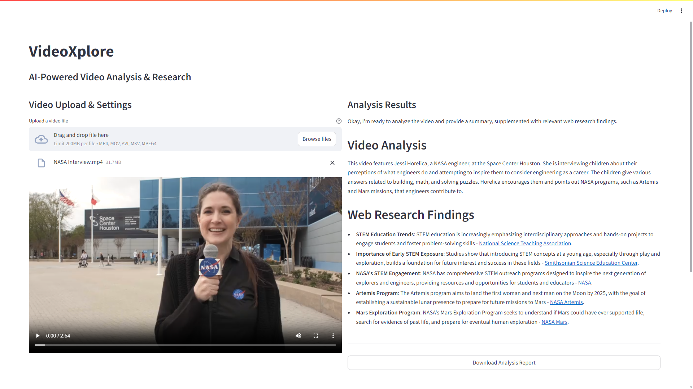

# VideoXplore

**AI-Powered Video Analysis & Research Platform**

VideoXplore is a production-ready Streamlit application that combines advanced video analysis with intelligent web research to provide comprehensive insights from video content. Built with Google's Gemini AI, enhanced with real-time web search capabilities using DuckDuckGo, containerized with Docker, automated with GitHub Actions, and deployed on Render with modern CI/CD practices.

## Site

**Try it now**: [video-xplore.onrender.com](https://video-xplore.onrender.com)

Upload any video and get AI-powered analysis with web research integration!


## Demo


## Features

### Core Functionality
- **Video Analysis**: Upload and analyze videos using Google Gemini's multimodal AI
- **Smart Web Research**: Supplement video insights with current web information via DuckDuckGo
- **Configurable Analysis**: Customizable search depth and focus areas
- **Export Results**: Download analysis reports as text files

### Production Features
- **Live Deployment**: Accessible worldwide at [video-xplore.onrender.com](https://video-xplore.onrender.com)
- **Docker Containerization**: Consistent environments across development and production
- **CI/CD Pipeline**: Automated building and deployment via GitHub Actions
- **Comprehensive Logging**: Application monitoring and debugging capabilities
- **Security Best Practices**: No hardcoded secrets, environment-based configuration

### Technical Excellence
- **Modern UI**: Clean, responsive interface built with Streamlit
- **Modular Architecture**: Well-structured, maintainable codebase
- **Customizable Prompts**: Configure AI prompts via environment variables
- **Professional Deployment**: Production-ready with Render hosting


## Quick Start


### Run with Docker (Recommended for Development)

1. **Clone the repository**
   ```bash
   git clone https://github.com/ShivamMishra1603/video-xplore.git
   cd video-xplore
   ```

2. **Run with Docker**
   ```bash
   docker build -t videoxplore .
   docker run -p 8501:8501 \
     -e GOOGLE_API_KEY=your_google_api_key \
     -e PHI_API_KEY=your_phi_api_key \
     -e VIDEO_ONLY_PROMPT_TEMPLATE="Analyze this video: {user_query}" \
     -e WEB_RESEARCH_PROMPT_TEMPLATE="Analyze and research: {user_query}" \
     -e WEB_RESEARCH_INSTRUCTION_TEMPLATE="Search for current information" \
     videoxplore
   ```

3. **Open your browser** → `http://localhost:8501`

### Local Development Setup

#### Prerequisites
- Python 3.8+
- Google API key with Gemini access
- Phidata API key
- Docker (optional but recommended)

#### Installation Steps

1. **Clone the repository**
   ```bash
   git clone https://github.com/ShivamMishra1603/video-xplore.git
   cd video-xplore
   ```

2. **Install dependencies**
   ```bash
   pip install -r requirements.txt
   ```

3. **Set up environment variables**
   ```bash
   # Copy the example file
   cp env_example.txt .env
   
   # Edit .env and add your API keys
   GOOGLE_API_KEY=your_google_api_key_here
   PHI_API_KEY=your_phi_api_key_here
   ```

4. **Run the application**
   ```bash
   streamlit run app.py
   ```

5. **Open your browser** → `http://localhost:8501`

## Usage

### Video Analysis

1. **Upload a video** - Supports MP4, MOV, AVI, and MKV formats
2. **Enter your query** - Describe what insights you want from the video
3. **Configure options** (optional) - Set search depth and focus areas
4. **Analyze** - Click the "Analyze Video" button

### Advanced Features

#### Web Research Integration
- **Toggle web research** on/off
- **Choose search depth**: Basic, Detailed, or Comprehensive
- **Focus areas**: Latest trends, Expert opinions, Statistics, Case studies, Technical details

#### Analysis Results
- **Video Analysis**: Direct insights from video content
- **Web Research Findings**: Current information with clickable source links
- **Export capability**: Download reports as text files


## Configuration

### Environment Variables

Create a `.env` file with the following variables:

```bash
GOOGLE_API_KEY=your_google_api_key_here
PHI_API_KEY=your_phi_api_key_here


VIDEO_ONLY_PROMPT_TEMPLATE="Your custom video analysis prompt..."
WEB_RESEARCH_PROMPT_TEMPLATE="Your custom web research prompt..."
WEB_RESEARCH_INSTRUCTION_TEMPLATE="Your custom research instruction..."
```

### Prompt Customization

VideoXplore supports fully customizable AI prompts through environment variables. This allows you to:

- **Modify analysis style** - Change tone, detail level, or format
- **Adjust output structure** - Customize how results are presented
- **Add domain expertise** - Include specialized knowledge or terminology
- **A/B test prompts** - Experiment with different approaches

See `env_example.txt` for complete prompt templates.


## Deployment & CI/CD

### Live Application
- **Production URL**: [video-xplore.onrender.com](https://video-xplore.onrender.com)
- **Hosting**: Render (Docker-based deployment)
- **Automatic Deployment**: Triggered by GitHub pushes

### CI/CD Pipeline
1. **Code Push** → GitHub repository
2. **GitHub Actions** → Automatically builds Docker image
3. **Render Deployment** → Deploys container to production
4. **Live Updates** → Application automatically updates

### Project Structure

#### Core Application
- **`app.py`** - Main application entry point and UI layout
- **`config.py`** - Configuration management and API setup
- **`agents.py`** - AI agent initialization with caching
- **`video_processor.py`** - Video file handling and Gemini integration
- **`ui_components.py`** - Reusable UI components and styling
- **`analysis.py`** - Analysis logic and prompt generation
- **`logger.py`** - Centralized logging system with file and console output

#### Deployment & DevOps
- **`Dockerfile`** - Container configuration for consistent deployments
- **`.dockerignore`** - Excludes sensitive files from Docker builds
- **`render.yaml`** - Render deployment configuration
- **`.github/workflows/build.yml`** - GitHub Actions CI/CD pipeline


## Dependencies

- **streamlit** - Web application framework
- **phidata** - AI agent framework with tool integration
- **google-generativeai** - Google Gemini API client
- **duckduckgo-search** - Web search functionality
- **python-dotenv** - Environment variable management


## Troubleshooting

### Common Issues

**"Google API key not found"**
- Ensure your `.env` file contains `GOOGLE_API_KEY=your_key_here`
- Verify the API key has Gemini access enabled

**"Prompt templates must be set in .env file"**
- Copy prompt templates from `env_example.txt` to your `.env` file
- Ensure all three prompt templates are defined

**Video processing errors**
- Check video file format (MP4, MOV, AVI, MKV supported)
- Ensure stable internet connection for Gemini API
- Verify video file size is within API limits

**Module import errors**
- Run `pip install -r requirements.txt`
- Ensure you're using Python 3.8+

### Logging & Monitoring

#### Local Development
- **Console output**: Real-time logs during development
- **Log files**: `logs/videoxplore_YYYYMMDD.log` (daily rotation)

#### Production (Render)
- **Render Dashboard**: Real-time application logs
- **Application Monitoring**: Error tracking and performance metrics
- **Build Logs**: CI/CD pipeline execution logs

## Results

### Sample Output

